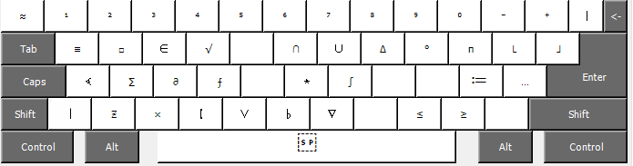
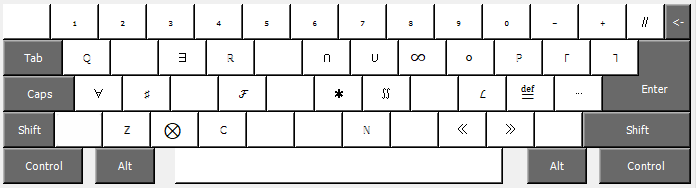
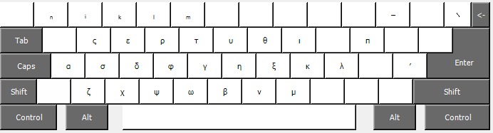
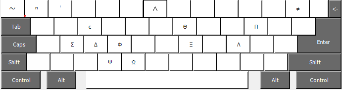

# Math keyboard layout

This keyboard layout is designed for scientists who have to work with math formulas, but find writing it through latex too tideous. Lots of math symbols are **included stright into unicode**, so it is possible just to type them as plain text using some key combinations.

The layout may be used for typing documents in LaTex or Markdown (e.g. converting it with Pandoc and unicode-replacing filter to HTML, Word or Latex) and just anywhere where these symbols are supported (most of them can be typed almost everywhere).

You can **download** it in this repository **in releases**. Unfortunately, it is available *only for Windows* yet. I don't know whether the programs for porting MS Keyboard Layouts to Linux will work fine on it. Write me if you managed to do this. :)

## Layout

I combined with significant modifications two layouts: math keyboard from [jkorpela.fi](https://jkorpela.fi/math/kbd.html) and standart Greek layout. Anyone who has been using them already will find this layout very familiar. The most important thing to be noticed it that it *behaves exactly as a common English layout*, no sudden "∧" instead of expected "&". This could be really convinient when typing Tex.

There are four keys that can be combined to type the symbols: **Alt, Shift, "\`" and "/"**. Up to three of them may be pressed in one time (Alt+Shift+[\`/]). Most of the keys use combination of two (all for now).

- **Alt:**

- **Alt + Shift**

- **\`**

- **\` + Shift**

//

- **/**

- **/ + Shift**

- **Other**

There is only one such symbol for now: ϕ — **"/ + Alt + F"** (don't confuse with φ — "/ + F")

*I hope there will be more symbols soon. Any suggestions and ideas to make this layout more useful are welcome!*

**P.S.** There are symbols that may seem the same, but are not. For example, "\~" (tilde) and "\∼" (tilde math operator). The last can be convinently used in LaTex, Latex would not recognise it as some rule-changing thing.

**P.P.S** There are several common symbols that are actually the same, but presented in different combinations, such as "≈" (*both " \` + \` " or "Alt + \' "*) and "∞" (*"Alt + Shift + I"* or *" \` + 8"*)

## Why it is better than other math keyboards?

1. It uses **four "dead keys":  Alt, Shift, "\`" and "/"**. It is more than in any keyboard I could find, so this layout has **just more unicode symbols** capacity. That also means it has more "degrees of freedom", so it is possible to make **using these keys more convinient**.
2. Without pressing any of the aforementioned "dead keys" this layout is just simple English keyboard we all are used to. That means you don't need to switch to basic layout to, e.g, type "\begin" in latex.
3. Just a plain Windows keyboard layout created via standart MS Keyboard Layout Creator. No extra software, no servers launching on Windows start. Just set it as one of used layouts and that's all. I also strongly recommend adding some shortcut for switching to it, like "Ctrl + Shift + 0" (can be set up in Windows' settings). 

**Warning:** I don't give guarantees that all unicode symbols presented there are supported in unicode-math package in latex and others like native katex. Nevertheless, most of them do, but it may be convinient to use some preprocessing scripts for replacing unicode with latex commands.

**Second warning:** some keyboard combinations may not work with software that also wants to use them. However, it is rather rare issue. 

## Gratitudes

I want to express my gratitude to the author of math keyboard from [jkorpela.fi](https://jkorpela.fi/math/kbd.html). I used it for a long time before I understood I need major changes in it. I'm going to make more of these changes over time.